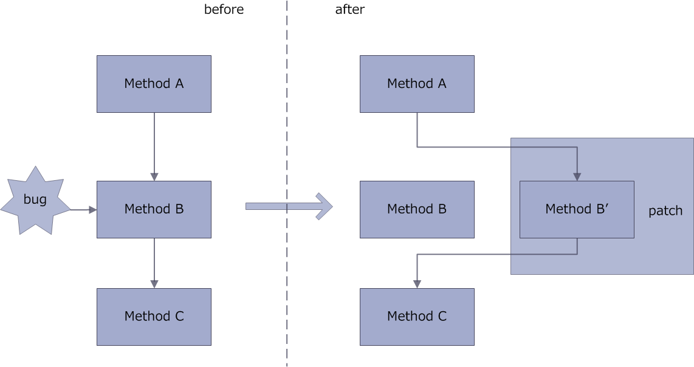
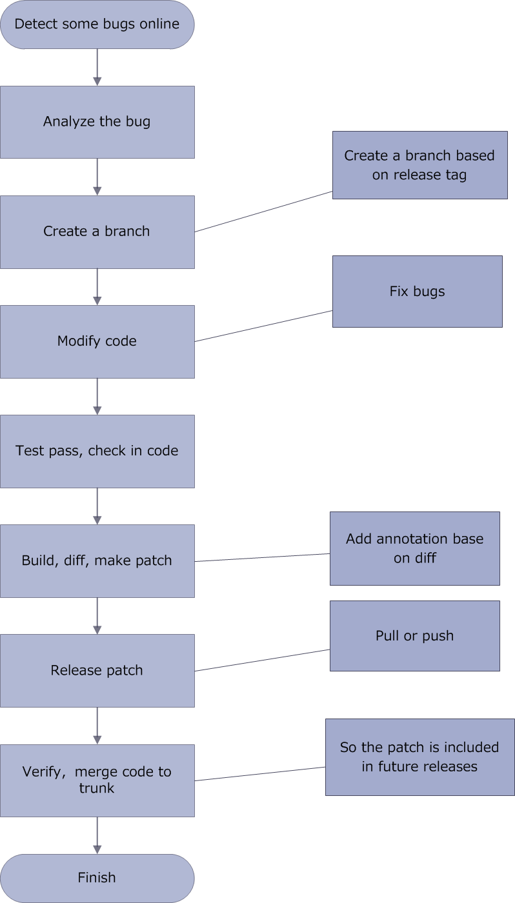

# AndFix

[ ](https://bintray.com/supern/maven/andfix/_latestVersion)
[](https://travis-ci.org/alibaba/AndFix)
[](LICENSE)

[](https://gitter.im/alibaba/AndFix?utm_source=badge&utm_medium=badge&utm_campaign=pr-badge)

AndFix is a library that offer hot-fix for Android App. It could help Android developer to fix App bugs online. Andfix is an acronym for "**And**roid hot-**fix**".

AndFix supports Android 2.3 to 6.0, arm and x86 architecture, dalvik runtime and art runtime.

AndFix's patch is .apatch file.

## Principle

The implementation principle of AndFix is method's body replace :



bug fix process:



## Integration

### How to get?

1. directly add AndFix aar to your project as compile libraries.
2. maven dependency:
	
	```
	<dependency>
  		<groupId>com.alipay.euler</groupId>
  		<artifactId>andfix</artifactId>
  		<version>0.3.1</version>
  		<type>aar</type>
	</dependency>
	```
or gradle dependency:

	```
	dependencies {
   		compile 'com.alipay.euler:andfix:0.3.1@aar'
	}
	```

### How to use?

1. initialize PatchManager:

	```
	patchManager = new PatchManager(context);
	patchManager.init(appversion);//current version
	```
	
2. load patch. load patch as early as possible, generally, at the initialization phase of your app (such as application.oncreate()):

	```
	patchManager.loadPatch();
	```

3. add patch. when new patch file has be downloaded,the patch will become effective immediately by add.

	```
	patchManager.addPatch(path);//path of the patch file that be downloaded
	```

### ProGuard

To ensure that these classes can be found after running an obfuscation and static analysis tool like ProGuard add the configuration below to your ProGuard configuration file.

* native method

	com.alipay.euler.andfix.AndFix
	
* annotation

	com.alipay.euler.andfix.annotation.MethodReplace

	
	```
	-keep class * extends java.lang.annotation.Annotation
	-keepclasseswithmembernames class * {
    	native <methods>;
	}
	```
	
## Developer Tool

The patch make tool is apkpatch.

### How to get?

Apkpatch can be found [here](https://github.com/alibaba/AndFix/raw/master/tools/apkpatch-1.0.3.zip)

### How to use?

* generate .apatch file:

```
usage: apkpatch -f <new> -t <old> -o <output> -k <keystore> -p <***> -a <alias> -e <***>
 -a,--alias <alias>     keystore entry alias.
 -e,--epassword <***>   keystore entry password.
 -f,--from <loc>        new Apk file path.
 -k,--keystore <loc>    keystore path.
 -n,--name <name>       patch name.
 -o,--out <dir>         output dir.
 -p,--kpassword <***>   keystore password.
 -t,--to <loc>          old Apk file path.
```

* merge .apatch files:

```
usage: apkpatch -m <apatch_path...> -o <output> -k <keystore> -p <***> -a <alias> -e <***>
 -a,--alias <alias>     keystore entry alias.
 -e,--epassword <***>   keystore entry password.
 -k,--keystore <loc>    keystore path.
 -m,--merge <loc...>    path of .apatch files.
 -n,--name <name>       patch name.
 -o,--out <dir>         output dir.
 -p,--kpassword <***>   keystore password.
```

### Code Protection

In order to achieve Code Protection,you might have used some techniques such as below:

* ProGuard
	
	you must save the mapping.txt, so your new version's build can use it with "-applymapping".
	
	<http://proguard.sourceforge.net/manual/usage.html#applymapping>
	
* Self Modifying Code, such as Bangcle 

	to generate patch file use raw apk best.
	
## Running sample

1. import samples/AndFixDemo to your IDE, set AndFixDemo depend on AndFix(library project or aar).
2. build project, save the package as 1.apk, and then install on device/emulator.
3. modify com.euler.test.A, references com.euler.test.Fix.
4. build project, save the package as 2.apk.
5. use apkpatch to make a patch.
6. rename the patch file to out.apatch, and then copy it onto sdcard.
7. run 1.apk,view logcat.

## API Documentation

The libraries javadoc can be found [here](https://rawgit.com/alibaba/AndFix/master/docs/index.html)

## Security

-  verify the signature of patch file
-  verify the fingerprint of optimize file

## Contact

...

## License

[Apache License, Version 2.0](http://www.apache.org/licenses/LICENSE-2.0.html) 

Copyright (c) 2015, alipay.com
